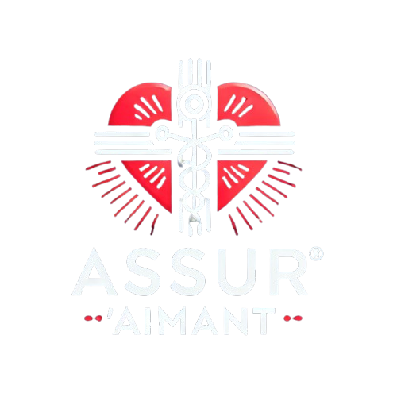

# Projet Assurance - Gestion des Clients, Prospect et Rendez-vous


<h1 align="center">
  
</h1>

## Description

Ce projet est une application web de gestion des clients, prospects et rendez-vous dans le secteur de l'assurance. L'objectif de ce projet est de fournir une interface utilisateur intuitive pour gérer des informations liées à des clients et prospects, ainsi que pour organiser des rendez-vous entre les opérateurs et leurs clients/prospects.

### Fonctionnalités principales :
- **Gestion des utilisateurs** : création, modification et suppression des opérateurs, clients et prospects.
- **Gestion des rendez-vous** : planification des rendez-vous physiques, téléphoniques et en visioconférence entre opérateurs et clients/prospects.
- **Estimation des montants** : calcul du montant estimé d'une assurance à partir des données d'un client via un modèle de régression.
- **Authentification** : gestion de l'authentification des utilisateurs (connexion, déconnexion, modification de mot de passe).
- **Formulaires dynamiques** : utilisation de formulaires Django pour la gestion des informations utilisateur.

## Technologies utilisées

- **Backend** : Django (Python)
- **Base de données** : SQLite (par défaut, peut être configurée avec PostgreSQL ou MySQL)
- **Front-end** : HTML, CSS, Bootstrap 4
- **Modèle de régression** : Scikit-learn, Python pour le calcul des montants d'assurance
- **Authentification** : Système d'authentification intégré de Django
- **Gestion des sessions** : Django Sessions

## Fonctionnalités détaillées

### 1. **Gestion des utilisateurs**

L'application permet de gérer trois types d'utilisateurs : **Opérateurs**, **Clients** et **Prospects**. 

- **Création d'utilisateur** : Les utilisateurs peuvent être ajoutés via des formulaires spécifiques pour chaque type d'utilisateur. L'opérateur peut inscrire des clients et prospects, et chaque type d'utilisateur possède un statut distinct dans l'application.
- **Modification d'utilisateur** : Les informations de l'utilisateur peuvent être mises à jour, y compris le nom, le prénom, l'email, le téléphone et d'autres informations spécifiques (poids, taille, etc.).
- **Suppression d'utilisateur** : Les utilisateurs peuvent être supprimés de la base de données via une interface.

### 2. **Gestion des rendez-vous**

Les opérateurs peuvent planifier des rendez-vous avec leurs clients ou prospects. Chaque rendez-vous peut être physique, téléphonique ou en visioconférence.

- **Formulaire de création de rendez-vous** : Un formulaire permet aux utilisateurs de saisir les détails du rendez-vous (date, heure, type, etc.).
- **Suppression de rendez-vous** : Les opérateurs peuvent supprimer un rendez-vous via une interface de gestion.
- **Affichage des rendez-vous** : Un tableau liste tous les rendez-vous planifiés pour chaque opérateur, avec les détails nécessaires.

### 3. **Estimation des montants d'assurance**

Le système inclut un modèle de régression pour calculer le montant estimé de l'assurance en fonction des informations fournies par l'utilisateur, telles que :
- Âge
- Sexe
- Poids
- Taille
- Nombre d'enfants
- Statut de fumeur

Ce modèle est préalablement entraîné et stocké sous forme de fichier pickle. Il peut être utilisé pour estimer rapidement les coûts d'assurance.

### 4. **Authentification et gestion des sessions**

Les utilisateurs peuvent se connecter et se déconnecter. En fonction de leur rôle (opérateur, client, prospect), l'application adapte les fonctionnalités accessibles.
- **Connexion et déconnexion** : L'utilisateur peut se connecter et se déconnecter via l'interface d'authentification.
- **Modification de mot de passe** : Un utilisateur peut changer son mot de passe via un formulaire sécurisé.
- **Création de compte** : Les utilisateurs peuvent s'inscrire en tant que prospects, puis être convertis en clients après validation.

## Installation et Configuration

### Prérequis

- Python 3.x
- Django
- Scikit-learn (pour le modèle de régression)
- SQLite (ou tout autre SGBD supporté par Django)

### Étapes d'installation

1. **Cloner le projet** :
   ```bash
   git clone https://github.com/Malek-Boumedine/prime_assurance.git
   cd ton-projet
   ```

2. **Créer un environnement virtuel** :
   ```bash
   python3 -m venv venv
   source venv/bin/activate  # sur Linux/Mac
   venv\Scripts\activate  # sur Windows
   ```

3. **Installer les dépendances** :
   ```bash
   pip install -r requirements.txt
   ```

4. **Appliquer les migrations** pour configurer la base de données :
   ```bash
   python manage.py migrate
   ```

5. **Démarrer le serveur de développement** :
   ```bash
   python manage.py runserver
   ```

6. **Accéder à l'application** :
   Ouvrez votre navigateur et accédez à `http://127.0.0.1:8000` pour commencer à utiliser l'application.

## Structure du projet

Voici la structure du projet Django :

```
assurance/
│
├── assurance/           # Dossier de l'application principale
│   ├── migrations/      # Dossier des migrations de la base de données
│   ├── templates/       # Dossier des templates HTML
│   ├── __init__.py
│   ├── settings.py      # Fichier de configuration de Django
│   ├── urls.py          # Fichier des URL de l'application
│   ├── views.py         # Fichier des vues
│
├── manage.py            # Script principal pour lancer l'application
├── requirements.txt     # Liste des dépendances Python
```

## Conclusion

Ce projet est une application complète de gestion des utilisateurs dans le domaine de l'assurance, avec des fonctionnalités pratiques pour la gestion des clients, prospects, rendez-vous et estimations d'assurance. Il utilise Django pour la partie back-end, avec des formulaires dynamiques et un modèle de régression pour fournir des estimations de coûts d'assurance.

Ce projet est une excellente démonstration de mes compétences en développement web avec Django, ainsi qu'en gestion des utilisateurs, traitement de données et mise en œuvre de modèles de machine learning dans une application web.

---

**Note** : Vous pouvez également explorer et tester cette application en la déployant sur votre propre serveur ou en utilisant un service d'hébergement tel que Heroku, AWS, ou DigitalOcean.

---

## Contact

### ✉️ alghom.ia@gmail.com  

<p align="left">
  
</p>

<div>
<h4>Malek BOUMEDINE </h4>
<a href = "mailto: malek.boumedine@gmail.com"></a>
<a href="https://www.linkedin.com/in/malek-boumedine" target="_blank">
  
</a>  
<a href="https://github.com/Malek-Boumedine" target="_blank">
  
</a>
</div>

<div>
<h4>Hacene ZERROUK </h4>
<a href = "mailto: hacenesimplone@gmail.com"></a>
<a href="https://www.linkedin.com/in/hacene-z" target="_blank">
  
</a>  
<a href="https://github.com/haceneZERROUK" target="_blank">
  
</a>
</div>

<div>
<h4>Khadija ABDELMALEK </h4>
<a href = "mailto: khad.abdelmalek@live.fr"></a>
<a href="https://www.linkedin.com/in/khadija-abdelmalek-0009732ba" target="_blank">
  
</a>  
<a href="https://github.com/khadmalek" target="_blank">
  
</a>
</div>

